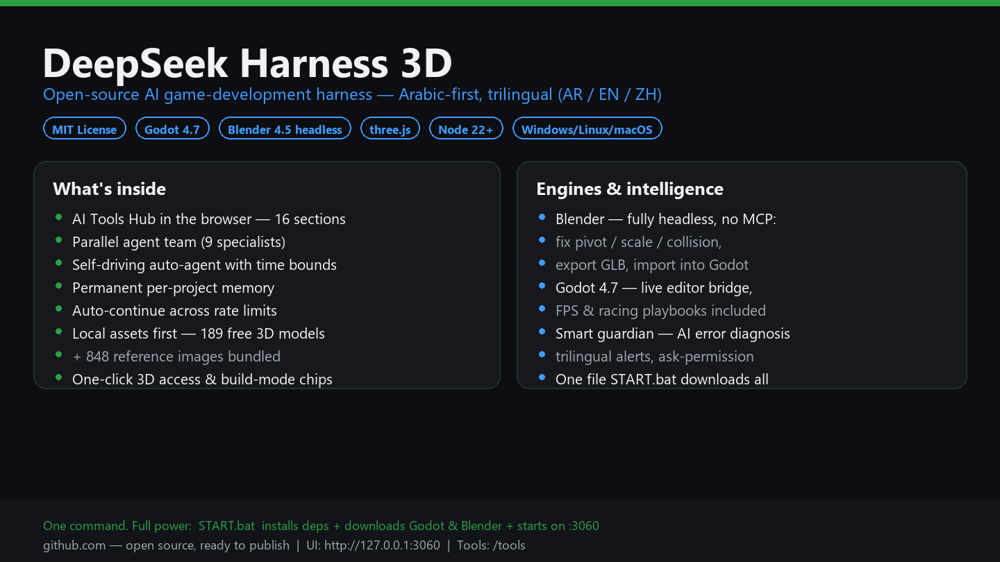

# DeepSeek Harness 3D v5

The everything-embedded edition: the full AI game-dev harness + a **free bundled asset pack** (189 3D models + 848 images, ready to use, no generation needed) + headless Blender & Godot engines — one command and it is born at full power.

النسخة المدمجة بالكامل: الهارنس كاملاً + **حزمة أصول مجانية مدمجة** (189 مجسم ثلاثي الأبعاد + 848 صورة جاهزة للاستخدام الفوري بدون أي توليد) + محركا Blender وGodot رأسياً — أمر واحد وتولد بكامل طاقتها.

---

## Quick Start / التشغيل السريع

**EN:** Double-click `تشغيل-الهارنس-v5.bat`. First run on a fresh checkout: installs dependencies, generates local config, auto-downloads Godot 4.7.2 + Blender 4.5 LTS (once), then starts on port **3060**. If the engines are already bundled (as in the full edition), it starts in seconds.

**AR:** انقر مرتين على `تشغيل-الهارنس-v5.bat`. أول تشغيل لنسخة نظيفة: يثبّت المكتبات ويولّد الإعداد وينزّل المحركين تلقائياً (لمرة واحدة) ثم يشغّل الخادم على المنفذ **3060**. وإن كانا مدمجين مسبقاً (كالنسخة الكاملة) فيبدأ خلال ثوانٍ.

| | EN | AR |
|---|---|---|
| Main UI | http://127.0.0.1:3060 | الواجهة الرئيسة |
| Tools hub | http://127.0.0.1:3060/tools | مركز الأدوات |

## The bundled free asset pack / حزمة الأصول المجانية المدمجة

**EN:** `tools-suite/assets-pack/` ships with the project: 189 models (glb) + 848 reference images — free to use. The agent searches it FIRST (`local_assets` tool) and only generates via Tripo when you explicitly ask. Add your own folders from the tools hub (أصول 3D → مجلدات الأصول الجاهزة).

**AR:** مجلد `tools-suite/assets-pack/` يأتي مع المشروع: 189 مجسماً + 848 صورة مرجعية — مجانية للاستخدام. يبحث الوكيل فيها **أولاً** (أداة local_assets) ولا يولّد عبر Tripo إلا بطلبك الصريح، ويمكنك إضافة مجلداتك من مركز الأدوات.

## Headless Blender + Godot / بلندر وGodot رأسياً

**EN:** `blender_code` + `asset_pipeline` drive Blender headless (no MCP) and hand exports to Godot automatically. See README-v3 history / the tools hub card.

**AR:** أداتا `blender_code` و`asset_pipeline` تشغّلان بلندر رأسياً بلا MCP وتسلّمان الناتج لGodot تلقائياً — كل ذلك من بطاقة المحركات في مركز الأدوات.

## Upload note / ملاحظة الرفع

**EN:** `.gitignore` already excludes what GitHub forbids/heavily discourages (node_modules, the 350MB Blender folder, the 180MB Godot.exe, machine-local cordis-runtime.yml). The asset pack ships with the repo; for very large packs prefer GitHub Releases assets.

**AR:** ملف `.gitignore` يستثني مسبقاً ما يمنعه GitHub (node_modules ومجلد Blender الضخم وGodot.exe الـ180MB وملف الإعداد المحلي). حزمة الأصول تُرفع مع المستودع؛ وللحزم الأكبر استخدم مرفقات GitHub Releases.

## License / الترخيص

MIT for the harness code. Blender (GPL) and Godot (MIT) are invoked as external programs — no GPL code included. The bundled asset pack is provided free by the project author.

## One file, everything / ملف واحد ينزّل كل شيء

**EN:** Downloaded from GitHub? Double-click **`START.bat`** (or the Arabic-named twin). On first run it installs dependencies, generates local config, auto-downloads Godot 4.7.2 (~180MB) and Blender 4.5 LTS (~350MB) from their official sources — then starts the server on port **3060** and opens your browser when ready. The free asset pack (189 GLB + 848 images) already ships inside the repo — no download needed. Requirements: Node.js 22+ and pnpm only.

**AR:** حمّلتها من GitHub؟ انقر مرتين على **`START.bat`** (أو التوأم العربي). أول تشغيل: يثبّت المكتبات، يولّد الإعداد، وينزّل تلقائياً Godot 4.7.2 (~180MB) وBlender 4.5 LTS (~350MB) من مصادرهما الرسمية — ثم يشغّل الخادم على المنفذ **3060** ويفتح المتصفح عند الجاهزية. حزمة الأصول المجانية (189 مجسم + 848 صورة) مضمّنة في المستودع أصلاً — لا تحتاج تنزيلاً. المطلوب فقط: Node.js 22+ وpnpm.
